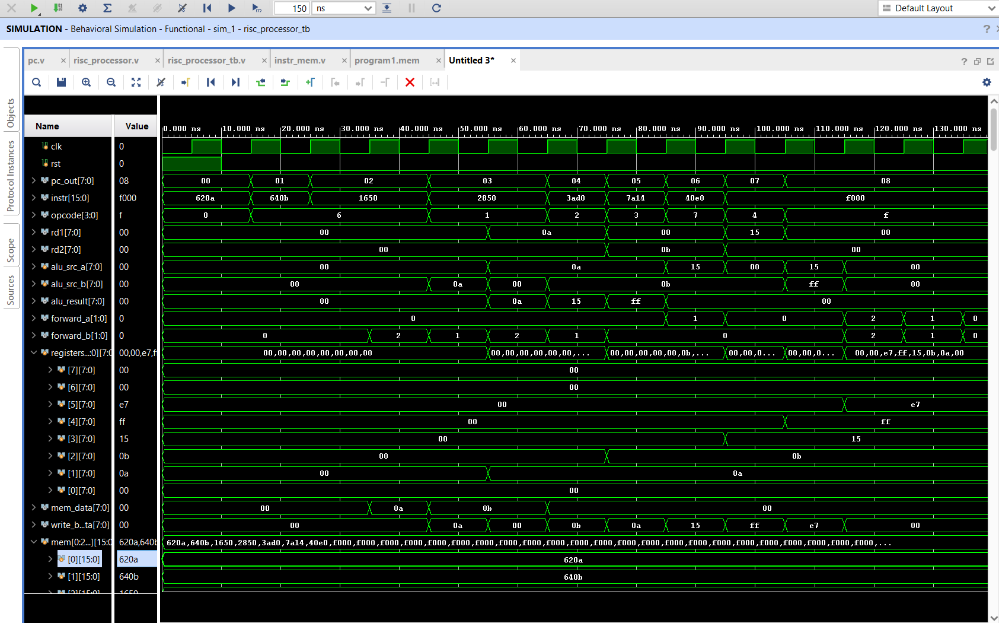
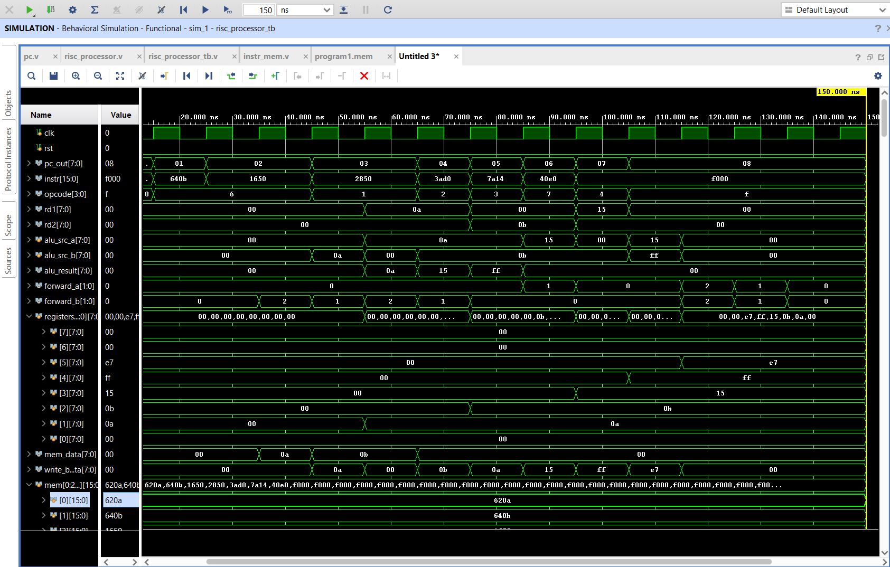

# 5-Stage Pipelined RISC Processor in Verilog

## Overview

This project implements an 8-bit 5-stage pipelined RISC processor using Verilog HDL and Vivado Simulator.

The processor consists of the following pipeline stages:

* Instruction Fetch (IF)
* Instruction Decode (ID)
* Execute (EX)
* Memory Access (MEM)
* Write Back (WB)

The design includes hazard detection and forwarding mechanisms to handle data dependencies and improve pipeline performance.

## Features

* 8-bit RISC architecture
* 5-stage pipelined design
* Register file with 8 general-purpose registers
* Arithmetic Logic Unit (ALU)
* Multiplier Unit
* Instruction Memory
* Data Memory
* Hazard Detection Unit
* Forwarding Unit
* Load and Store operations
* HALT instruction support

## Modules Implemented

* pc.v
* instr_mem.v
* if_id.v
* instr_decoder.v
* control_unit.v
* register_file.v
* hazard_detection.v
* id_ex.v
* forwarding_unit.v
* alu.v
* multiplier.v
* ex_mem.v
* data_mem.v
* mem_wb.v
* risc_processor.v

## Test Program

620A
640B
1650
2850
3AD0
7A14
40E0
F000

## Instruction Set

| Opcode | Operation |
| ------ | --------- |
| 0001   | ADD       |
| 0010   | SUB       |
| 0011   | MUL       |
| 0100   | CMP       |
| 0110   | LOAD      |
| 0111   | STORE     |
| 1111   | HALT      |

## Final Results

| Register | Value |
| -------- | ----- |
| R1       | 0A    |
| R2       | 0B    |
| R3       | 15    |
| R4       | FF    |
| R5       | E7    |

Memory[20] = E7

## Simulation Waveforms

## Verification

The processor was simulated and verified using Vivado Simulator.

Verified functionality:

* Instruction Fetch
* Instruction Decode
* Arithmetic Operations
* Multiplication
* Load/Store Operations
* Hazard Detection
* Data Forwarding
* Write Back Stage

## Tools Used

* Verilog HDL
* Vivado Design Suite
* GitHub

## Author

Chenga Reddy Bhargavi
